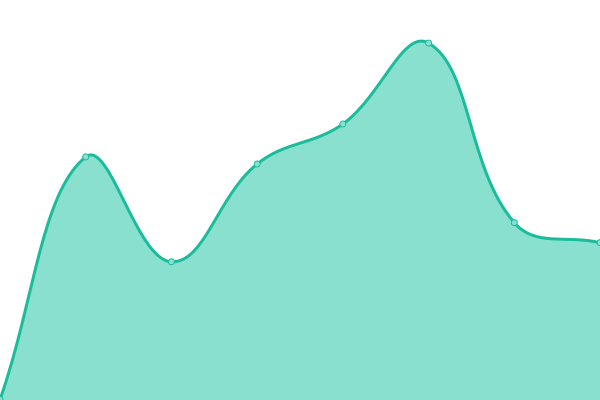
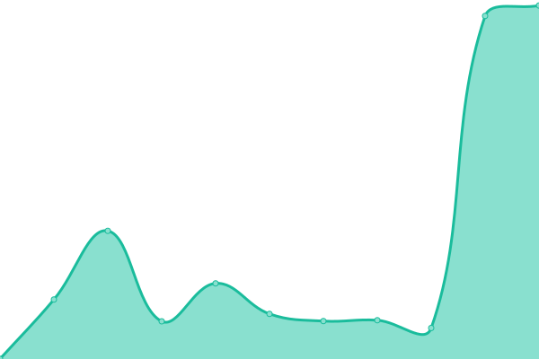

# [📈 Live Status](https://StroyCo.github.io/stroy-up): <!--live status--> **🟧 Partial outage**

This repository contains the open-source uptime monitor and status page for [StroyCo](https://portfolio.stroyco.eu), powered by [Upptime](https://github.com/upptime/upptime).

With [Upptime](https://upptime.js.org), you can get your own unlimited and free uptime monitor and status page, powered entirely by a GitHub repository. We use [Issues](https://github.com/StroyCo/stroy-up/issues) as incident reports, [Actions](https://github.com/StroyCo/stroy-up/actions) as uptime monitors, and [Pages](https://StroyCo.github.io/stroy-up) for the status page.

<!--start: status pages-->
<!-- This summary is generated by Upptime (https://github.com/upptime/upptime) -->
<!-- Do not edit this manually, your changes will be overwritten -->
<!-- prettier-ignore -->
| URL | Status | History | Response Time | Uptime |
| --- | ------ | ------- | ------------- | ------ |
|  [Portfolio](https://portfolio.stroyco.eu) | 🟥 Down | [portfolio.yml](https://github.com/StroyCo/stroy-up/commits/HEAD/history/portfolio.yml) | 

 792ms
     
 | 

<a href="https://StroyCo.github.io/stroy-up/history/portfolio">99.82%</a>
    

|  [Jellyfin](https://jelly.stroyco.eu/) | 🟥 Down | [jellyfin.yml](https://github.com/StroyCo/stroy-up/commits/HEAD/history/jellyfin.yml) | 

 719ms
     
 | 

<a href="https://StroyCo.github.io/stroy-up/history/jellyfin">99.82%</a>
    

|  [Jellyseer](https://jellyseerr.stroyco.eu) | 🟥 Down | [jellyseer.yml](https://github.com/StroyCo/stroy-up/commits/HEAD/history/jellyseer.yml) | 

 984ms
     
 | 

<a href="https://StroyCo.github.io/stroy-up/history/jellyseer">98.80%</a>
    

|  [SeRA](https://develop-sera.stroyco.eu/) | 🟥 Down | [se-ra.yml](https://github.com/StroyCo/stroy-up/commits/HEAD/history/se-ra.yml) | 

 700ms
     
 | 

<a href="https://StroyCo.github.io/stroy-up/history/se-ra">99.75%</a>
    

|  [RandomGraill](https://randomgraill.web.app) | 🟩 Up | [random-graill.yml](https://github.com/StroyCo/stroy-up/commits/HEAD/history/random-graill.yml) | 

 120ms
     
 | 

<a href="https://StroyCo.github.io/stroy-up/history/random-graill">100.00%</a>
    

<!--end: status pages-->

[**Visit our status website →**](https://StroyCo.github.io/stroy-up)

## 📄 License

- Powered by: [Upptime](https://github.com/upptime/upptime)
- Code: [MIT](./LICENSE) © [Anand Chowdhary](https://anandchowdhary.com), supported by [Pabio](https://pabio.com)
- Data in the `./history` directory: [Open Database License](https://opendatacommons.org/licenses/odbl/1-0/)
