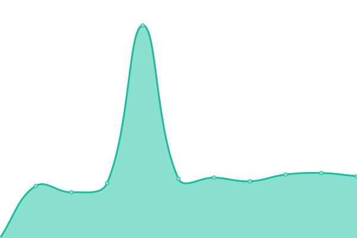
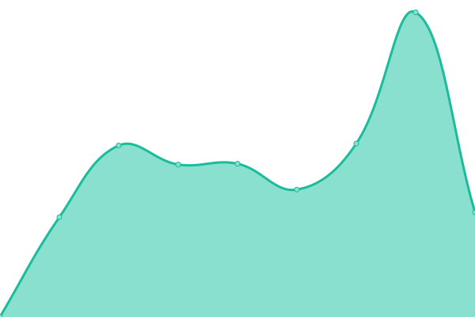
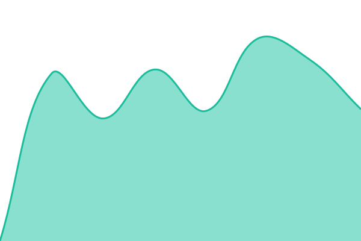
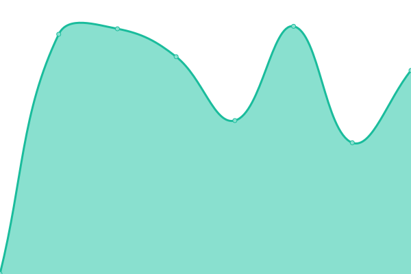

# [📈 Live Status](https://StroyCo.github.io/stroy-up): <!--live status--> **🟧 Partial outage**

This repository contains the open-source uptime monitor and status page for [StroyCo](https://portfolio.stroyco.eu), powered by [Upptime](https://github.com/upptime/upptime).

With [Upptime](https://upptime.js.org), you can get your own unlimited and free uptime monitor and status page, powered entirely by a GitHub repository. We use [Issues](https://github.com/StroyCo/stroy-up/issues) as incident reports, [Actions](https://github.com/StroyCo/stroy-up/actions) as uptime monitors, and [Pages](https://StroyCo.github.io/stroy-up) for the status page.

<!--start: status pages-->
<!-- This summary is generated by Upptime (https://github.com/upptime/upptime) -->
<!-- Do not edit this manually, your changes will be overwritten -->
<!-- prettier-ignore -->
| URL | Status | History | Response Time | Uptime |
| --- | ------ | ------- | ------------- | ------ |
|  [StroyBot](https://stroybot.stroyco.eu) | 🟥 Down | [stroy-bot.yml](https://github.com/StroyCo/stroy-up/commits/HEAD/history/stroy-bot.yml) | 

 4184ms
     
 | 

<a href="https://StroyCo.github.io/stroy-up/history/stroy-bot">100.00%</a>
    

|  [StroyGetter](https://stroygetter.fr) | 🟩 Up | [stroy-getter.yml](https://github.com/StroyCo/stroy-up/commits/HEAD/history/stroy-getter.yml) | 

 1364ms
     
 | 

<a href="https://StroyCo.github.io/stroy-up/history/stroy-getter">98.98%</a>
    

|  [IFA x HONOR - Contest](https://ifa.honor.events) | 🟩 Up | [ifa-x-honor-contest.yml](https://github.com/StroyCo/stroy-up/commits/HEAD/history/ifa-x-honor-contest.yml) | 

 933ms
     
 | 

<a href="https://StroyCo.github.io/stroy-up/history/ifa-x-honor-contest">100.00%</a>
    

|  [Orange x HONOR - Contest](https://orange-contest.honor.events) | 🟩 Up | [orange-x-honor-contest.yml](https://github.com/StroyCo/stroy-up/commits/HEAD/history/orange-x-honor-contest.yml) | 

 806ms
     
 | 

<a href="https://StroyCo.github.io/stroy-up/history/orange-x-honor-contest">100.00%</a>
    

|  [StroyBot HONOR Version](https://stroybot.honor.events) | 🟩 Up | [stroy-bot-honor-version.yml](https://github.com/StroyCo/stroy-up/commits/HEAD/history/stroy-bot-honor-version.yml) | 

 781ms
     
 | 

<a href="https://StroyCo.github.io/stroy-up/history/stroy-bot-honor-version">100.00%</a>
    

<!--end: status pages-->

[**Visit our status website →**](https://StroyCo.github.io/stroy-up)

## 📄 License

- Powered by: [Upptime](https://github.com/upptime/upptime)
- Code: [MIT](./LICENSE) © [Anand Chowdhary](https://anandchowdhary.com), supported by [Pabio](https://pabio.com)
- Data in the `./history` directory: [Open Database License](https://opendatacommons.org/licenses/odbl/1-0/)
