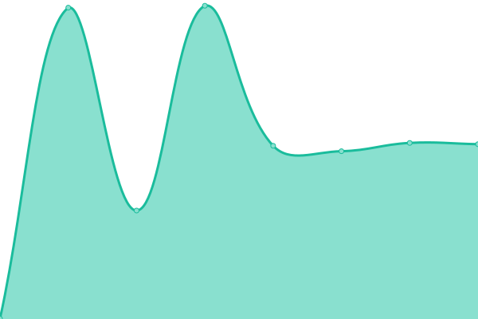

# [📈 Live Status](https://StroyCo.github.io/stroy-up): <!--live status--> **🟩 All systems operational**

This repository contains the open-source uptime monitor and status page for [StroyCo](https://portfolio.stroyco.eu), powered by [Upptime](https://github.com/upptime/upptime).

With [Upptime](https://upptime.js.org), you can get your own unlimited and free uptime monitor and status page, powered entirely by a GitHub repository. We use [Issues](https://github.com/StroyCo/stroy-up/issues) as incident reports, [Actions](https://github.com/StroyCo/stroy-up/actions) as uptime monitors, and [Pages](https://StroyCo.github.io/stroy-up) for the status page.

<!--start: status pages-->
<!-- This summary is generated by Upptime (https://github.com/upptime/upptime) -->
<!-- Do not edit this manually, your changes will be overwritten -->
<!-- prettier-ignore -->
| URL | Status | History | Response Time | Uptime |
| --- | ------ | ------- | ------------- | ------ |
|  [Jellyfin](https://jelly.stroyco.eu) | 🟩 Up | [jellyfin.yml](https://github.com/StroyCo/stroy-up/commits/HEAD/history/jellyfin.yml) | 

 840ms
     
 | 

<a href="https://StroyCo.github.io/stroy-up/history/jellyfin">100.00%</a>
    

|  [Jellyseer](https://jellyseerr.stroyco.eu) | 🟩 Up | [jellyseer.yml](https://github.com/StroyCo/stroy-up/commits/HEAD/history/jellyseer.yml) | 

 997ms
     
 | 

<a href="https://StroyCo.github.io/stroy-up/history/jellyseer">100.00%</a>
    

|  [StroyGetter](https://stroygetter.stroyco.eu) | 🟩 Up | [stroy-getter.yml](https://github.com/StroyCo/stroy-up/commits/HEAD/history/stroy-getter.yml) | 

 614ms
     
 | 

<a href="https://StroyCo.github.io/stroy-up/history/stroy-getter">100.00%</a>
    

|  [StroyBot](https://stroybot.stroyco.eu) | 🟩 Up | [stroy-bot.yml](https://github.com/StroyCo/stroy-up/commits/HEAD/history/stroy-bot.yml) | 

 559ms
     
 | 

<a href="https://StroyCo.github.io/stroy-up/history/stroy-bot">100.00%</a>
    

|  [GoofyKHP - Application](https://app.goofykhp.fr/) | 🟩 Up | [goofy-khp-application.yml](https://github.com/StroyCo/stroy-up/commits/HEAD/history/goofy-khp-application.yml) | 

 551ms
     
 | 

<a href="https://StroyCo.github.io/stroy-up/history/goofy-khp-application">100.00%</a>
    

|  [GoofyKHP - Website](https://dash.goofykhp.fr/) | 🟩 Up | [goofy-khp-website.yml](https://github.com/StroyCo/stroy-up/commits/HEAD/history/goofy-khp-website.yml) | 

 777ms
     
 | 

<a href="https://StroyCo.github.io/stroy-up/history/goofy-khp-website">100.00%</a>
    

<!--end: status pages-->

[**Visit our status website →**](https://StroyCo.github.io/stroy-up)

## 📄 License

- Powered by: [Upptime](https://github.com/upptime/upptime)
- Code: [MIT](./LICENSE) © [Anand Chowdhary](https://anandchowdhary.com), supported by [Pabio](https://pabio.com)
- Data in the `./history` directory: [Open Database License](https://opendatacommons.org/licenses/odbl/1-0/)
